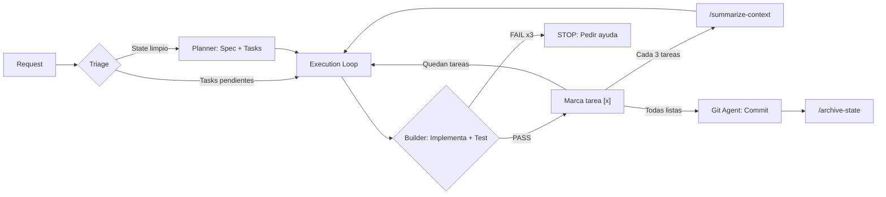
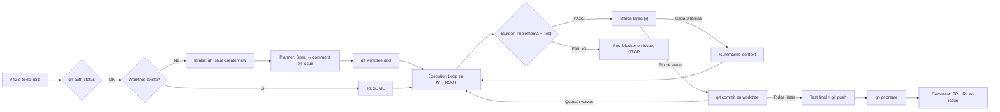

# Claude Code Multi-Agent Framework

> **Esto es una propuesta, no una prescripcion.** Este framework representa un enfoque para orquestar [Claude Code](https://docs.anthropic.com/en/docs/claude-code) como un equipo de desarrollo multi-agente. No es la forma definitiva de trabajar con Claude Code — es un punto de partida que puedes adaptar, modificar, extender o adoptar parcialmente segun tu flujo de trabajo. Toma lo que te sirva, cambia lo que no.

Un framework de orquestacion multi-agente que convierte a Claude Code en un equipo de desarrollo con roles especializados, memoria persistente y flujos automatizados.

Usa **dispatch nativo** — los agents tienen `description` en su frontmatter YAML y Claude los invoca automaticamente. Las skills usan el formato estandar `name/SKILL.md` con `user-invocable: true`.

**[Read in English](README.md)**

---

## Por que existe

Claude Code es poderoso por si solo, pero para proyectos complejos a menudo necesitas:

- **Separacion de roles** — un planificador que no escribe codigo, un builder que no toca decisiones de arquitectura
- **Memoria persistente** — contexto que sobrevive entre sesiones (docs de arquitectura, estado de tareas, decisiones)
- **Flujos estructurados** — pipelines repetibles para features, fixes rapidos, investigacion, auditorias
- **Trazabilidad** — desde GitHub Issue hasta spec, branch, commits y PR, todo conectado

Este framework provee una convencion basada en archivos que le da estas capacidades a Claude Code sin herramientas externas. Son solo archivos markdown y YAML — Claude los lee y sigue las instrucciones.

---

## Dos Variantes

El framework viene en dos variantes. Elige la que se ajuste a tu flujo de trabajo:

| | **Linear** (`.claude/`) | **Feature-driven** (`worktree/.claude/`) |
|---|---|---|
| **Flujo** | Un cambio a la vez, secuencial | Un issue = un worktree = un branch |
| **GitHub Issues** | No | Si — lee/crea issues, comenta progreso, crea PRs |
| **Aislamiento** | Trabaja en el directorio actual | Un worktree por feature, trabajo en paralelo |
| **Trazabilidad** | Commits convencionales | Issue → spec → worktree → commits → PR |
| **Resumibilidad** | `/develop` retoma desde `project-state.md` | `/feature #42` retoma desde el worktree |
| **Ideal para** | Trabajo solo, proyectos simples | Equipos, proyectos con issues, multiples features |

Puedes empezar con Linear y cambiar a Feature-driven despues — la variante Feature-driven es un superset (mismos agents + skills + una skill extra).

### Visualizacion de flujos

**Linear (`/develop`)** — Ciclo secuencial para trabajo individual:



**Feature-driven (`/feature`)** — Ciclo basado en issues y worktrees para equipos:



### Cuando elegir cada una

| Criterio | Linear | Feature-driven |
|----------|--------|----------------|
| Trabajo solo, un cambio a la vez | Ideal | Excesivo |
| Equipo, multiples features en paralelo | Insuficiente | Ideal |
| Proyecto sin GitHub Issues | Unica opcion | No aplica |
| Proyecto con issues + PRs como flujo | Posible pero manual | Automatizado |
| Quieres trazabilidad issue → PR | No incluida | Incluida |
| Proyecto simple (< 10 archivos) | Ideal | Excesivo |
| Proyecto grande con areas protegidas | Funciona | Funciona + aislamiento |
| Necesitas resumir despues de interrupcion | `/develop` retoma | `/feature #N` retoma con worktree intacto |

**Regla general**: Si tu flujo ya usa GitHub Issues y Pull Requests, elige Feature-driven. Si trabajas solo y commiteas directo a main, elige Linear.

---

## Guia de Implementacion

### Paso 1: Copiar el framework

**Variante Linear** — trabajo secuencial, sin GitHub Issues:

```bash
# Desde la raiz de tu proyecto
cp -r /ruta/al/framework/.claude/ ./.claude/
```

**Variante Feature-driven** — con GitHub Issues, worktrees y PRs:

```bash
# Desde la raiz de tu proyecto
cp -r /ruta/al/framework/worktree/.claude/ ./.claude/
```

> Ambas variantes incluyen los mismos agents, skills y memoria. La variante feature-driven agrega la skill `/feature` y permisos para `gh` y `git worktree`.

### Paso 2: Configurar tu proyecto

Edita `.claude/project.yml` — define QUE es tu proyecto:

```yaml
name: MiSaaS
description: Plataforma de gestion de inventarios

domain:
  language: es
  entities:
    - organization (tenant)
    - user
    - warehouse
    - product
    - order

tenant:
  enabled: true
  column: org_id
  table: organizations
  isolation: rls

invariants:
  - name: Tenant Isolation
    rule: All DB queries filter by org_id. No cross-tenant data leaks.
    severity: critical
  - name: Stock Integrity
    rule: Stock decrements MUST be atomic. No overselling.
    severity: critical

critical_flows:
  - name: Order Fulfillment
    description: Validate stock → reserve → charge → dispatch
    tables: [orders, inventory, payments]
    type: transaction

gate_protected_areas:
  - pattern: "migrations/"
    reason: Schema changes require /develop
  - pattern: "middleware*"
    reason: Auth and routing
```

### Paso 3: Configurar tu stack

Edita `.claude/stack.yml` — define COMO se ejecuta:

```yaml
name: node-docker-prisma

runtime:
  exec_prefix: "docker compose exec api"
  note: "No local runtime. Always use exec_prefix."

commands:
  install: "npm install"
  test: "npx vitest run"
  test_single: "npx vitest run {file}"
  lint: "npx eslint {path}"
  type_check: "npx tsc --noEmit"
  build: "npm run build"
  dev: "npm run dev"

paths:
  source: "src/"
  tests: "tests/"
  migrations: "prisma/migrations/"
  config: "package.json"

conventions:
  test_file_pattern: "{name}.test.ts"
  module_structure: "src/{module}/"

framework:
  name: "Express + Prisma"
  backend: "PostgreSQL"
  orm: "Prisma"
```

### Paso 4: Documentar tu arquitectura

Edita `.claude/memory/architecture.md` — la fuente de verdad del diseno de tu sistema:

- Overview del sistema
- Stack y modelo de ejecucion
- Modelo de datos (entidades, relaciones)
- Roles y autorizacion
- Flujos criticos (contratos: inputs → validaciones → pasos → outputs)
- Patrones prohibidos

Los agents consultan este archivo antes de escribir cualquier codigo.

### Paso 5: Empezar a usar

```bash
claude
# Dentro de Claude Code:
/develop Implementar sistema de notificaciones
/quick Cambiar el texto del boton de login
/research Comparar Redis vs Memcached para caching
/feature #42                              # (Solo feature-driven)
/feature Agregar sistema de alertas       # (Solo feature-driven)
/feature #42                          # Resumir si fue interrumpido
```

---

## Como Funciona

### Estructura

```
tu-proyecto/
├── .claude/
│   ├── CLAUDE.md                          # Entry point — refs a project.yml y stack.yml
│   ├── project.yml                        # QUE: identidad, dominio, invariantes, flujos criticos
│   ├── stack.yml                          # COMO: runtime, comandos, paths, convenciones
│   ├── settings.local.json                # Permisos de herramientas
│   │
│   ├── agents/                            # 3 subagents con frontmatter nativo
│   │   ├── planner.md                     #   Planifica, disena, investiga
│   │   ├── builder.md                     #   Codifica, testea, ejecuta
│   │   └── git.md                         #   Commit, push (safety gate)
│   │
│   ├── skills/                            # Flujos invocables (/nombre)
│   │   ├── develop/SKILL.md               #   Pipeline E2E completo
│   │   ├── quick/SKILL.md                 #   Fast-path sin planificacion
│   │   ├── research/SKILL.md              #   Investigacion tecnica
│   │   ├── feature/SKILL.md               #   (Feature-driven) Pipeline Issue → PR
│   │   ├── parallel/SKILL.md              #   Ejecucion multi-sesion
│   │   ├── audit/SKILL.md                 #   Auditoria de seguridad
│   │   ├── summarize-context/SKILL.md     #   Compresion de contexto
│   │   ├── validate-invariants/SKILL.md   #   Verificacion de invariantes
│   │   ├── write-tests/SKILL.md           #   Estrategia de testing
│   │   ├── prepare-commit/SKILL.md        #   Generar commit message
│   │   ├── analyze-architecture/SKILL.md  #   Detectar drift arquitectonico
│   │   └── archive-state/SKILL.md         #   Archivar estado completado
│   │
│   └── memory/                            # Estado persistente
│       ├── architecture.md                #   Diseno del sistema (source of truth)
│       ├── project-state.md               #   Tareas en curso (cap 80 lineas)
│       ├── research.md                    #   Log de investigaciones
│       ├── locks.md                       #   Coordinacion multi-sesion (TTL 30 min)
│       ├── decisions/                     #   Registro de decisiones arquitectonicas
│       │   └── TEMPLATE.md                #     Plantilla DEC-####.md
│       └── archive/                       #   Estados completados
```

### Agents

Los agents tienen `description` y `allowed-tools` en su frontmatter YAML. Claude Code los invoca automaticamente cuando la tarea encaja.

| Agent | Rol | Puede | No puede |
|-------|-----|-------|----------|
| `planner` | Planificador + Arquitecto + Investigador | Leer, analizar, disenar, escribir en memory/ | Codigo, commits, Bash |
| `builder` | Programador + QA | Escribir codigo, tests, ejecutar comandos | Editar arquitectura, commits |
| `git` | Release Manager | Commits y push | Escribir codigo o editar archivos |

### Skills

Las skills son flujos que se invocan con `/nombre` dentro de Claude Code.

**Principales:**

| Skill | Cuando usarla | Variante |
|-------|---------------|----------|
| `/develop` | Feature nueva, bug complejo, cualquier cambio que necesite planificacion | Ambas |
| `/quick` | Cambio trivial que no toca areas protegidas (typo, CSS, campo simple) | Ambas |
| `/research` | Evaluar opciones tecnicas antes de decidir | Ambas |
| `/feature` | Pipeline E2E: issue → spec → worktree → implementacion → PR | Feature-driven |

**Auxiliares:**

| Skill | Que hace |
|-------|----------|
| `/parallel` | Ejecuta tareas de la wave actual en multiples terminales |
| `/audit` | Auditoria de seguridad del codebase |
| `/write-tests` | Define estrategia de testing y genera tests |
| `/prepare-commit` | Valida tests + genera mensaje de commit convencional |
| `/validate-invariants` | Verifica que no se rompan reglas criticas |
| `/analyze-architecture` | Compara el codigo actual vs architecture.md |
| `/summarize-context` | Comprime el estado para liberar tokens |
| `/archive-state` | Archiva estado completado y resetea el tracker |

---

## Flujos de Trabajo

### `/develop` — Pipeline completo

El flujo principal. Planifica, implementa en loop, y commitea.

```
PHASE 0: Triage
  Lee project-state.md → hay tareas pendientes? → RESUME
  Analiza request → necesita cambio de arquitectura?

PHASE 1: Architecture (condicional)
  Lee decisions/ para no re-litigar decisiones pasadas
  Planner agent actualiza architecture.md
  Registra nuevas decisiones como DEC-####.md
  Output: "✅ Architecture updated."

PHASE 2: Execution Loop
  Por cada tarea [ ] en project-state.md:
    Builder agent implementa + testea
    PASS → marca [x], persiste estado
    FAIL → reintenta (max 2) → STOP si falla 3x
  Cada 3 tareas → /summarize-context

PHASE 3: Finalization
  Git agent commit + push
  /archive-state → resetea project-state.md
```

### `/quick` — Fast path

Para cambios triviales que no requieren planificacion.

```
Gate: Lee project.yml → toca area protegida?
  SI → ABORT, sugiere /develop

Preflight:
  git diff --stat → >5 archivos o >200 lineas? → ABORT, sugiere /develop
  /validate-invariants → FAIL? → ABORT

Build:
  Builder agent implementa → Git agent commitea
```

### `/feature` — Issue-to-PR (variante feature-driven)

Pipeline completo desde GitHub Issue hasta Pull Request, con aislamiento por worktree.

```
PHASE 0: Resume Check
  Parse input (#42, URL, o descripcion libre)
  gh auth status → verificar autenticacion
  Si worktree existe → RESUME desde fase pendiente

PHASE 1: Intake
  Descripcion libre → gh issue create
  Issue existente → leer contenido
  Post comment: "Session started"

PHASE 2: Spec
  Planner agent produce spec estructurada
  Post spec como comment en issue
  Escribir tasks a project-state.md

PHASE 3: Worktree Setup
  git fetch origin
  git worktree add WT_ROOT -b feat/ISSUE-SLUG origin/main
  Copiar state al worktree

PHASE 4: Execution (dentro del worktree)
  Builder agent implementa + testea cada task
  Commits por wave dentro del worktree
  Post progreso al issue

PHASE 5: Integration
  Test suite final → git push → gh pr create
  Post PR URL al issue

PHASE 6: Cleanup
  Archivar state, post resumen final
  NO remover worktree (puede necesitar fixes post-review)
```

**Ejemplo de uso:**

```bash
claude
# Dentro de Claude Code:
/feature #42                          # Implementar issue existente
/feature Agregar sistema de alertas   # Crear issue + implementar
/feature #42                          # Resumir si fue interrumpido
```

**Convencion de paths:**

```
mi-proyecto/                         # REPO_ROOT (checkout principal)
├── .claude/
├── src/
└── ...

.worktrees/                          # Directorio hermano al repo
├── feat/42-add-notifications/       # Worktree para issue #42
└── feat/57-fix-auth/                # Otra feature en paralelo
```

### `/parallel` — Multi-sesion

Abre multiples terminales de Claude Code para ejecutar tareas de la misma wave en paralelo:

```bash
# Terminal 1        # Terminal 2        # Terminal 3
/parallel           /parallel           /parallel
```

Cada sesion toma una tarea diferente via coordinacion en `locks.md`. Locks con mas de 30 minutos se consideran expirados y se liberan automaticamente.

---

## Organizacion del Trabajo (Waves)

Las **waves** son la unidad fundamental de organizacion del trabajo en el framework. Una wave es un grupo logico de tareas coherentes que se ejecutan juntas, se validan juntas y se commitean juntas.

### Que es una wave

```
Wave 1: Base de Datos
  [ ] Crear migracion con nuevas tablas
  [ ] Agregar columnas a tablas existentes
  [ ] Actualizar schema.sql

Wave 2: Backend
  [ ] Crear server actions
  [ ] Actualizar queries existentes
  [ ] Agregar validaciones

Wave 3: UI
  [ ] Crear componentes de formulario
  [ ] Actualizar paginas existentes
  [ ] Agregar feedback visual
```

### Por que waves y no una lista plana

- **Foco de contexto**: El builder agent trabaja en un dominio a la vez (DB, luego backend, luego UI), reduciendo errores por cambio de contexto
- **Checkpoints de memoria**: `/summarize-context` se ejecuta cada 3 tareas, y las waves proporcionan puntos naturales de corte
- **Commits atomicos**: Cada wave completada = un commit con significado (`feat(auth): wave 1 — database schema`)
- **Paralelizacion**: En `/parallel`, multiples sesiones toman tareas de la misma wave sin conflictos

### Ciclo de vida de una wave

```
Planner define waves en project-state.md
        ↓
Builder ejecuta tarea [ ] → test → PASS → marca [x]
        ↓ (cada 3 tareas)
/summarize-context comprime estado
        ↓ (wave completa)
Git agent: commit atomico de la wave
        ↓ (siguiente wave)
Repetir hasta todas [x]
        ↓
/archive-state → reset
```

### Waves en cada variante

| | Linear (`/develop`) | Feature-driven (`/feature`) |
|---|---|---|
| Quien define las waves | Planner agent en project-state.md | Planner agent, posteado como comment en issue |
| Commit por wave | Si, al final de cada wave | Si, dentro del worktree |
| Progreso visible | En project-state.md local | En project-state.md + comments en GitHub Issue |
| Paralelizable | Si, via `/parallel` | Si, via `/parallel` dentro del worktree |

---

## Estrategia de Testing Automatico

El framework ejecuta tests en multiples niveles, configurados en `stack.yml`. No necesitas invocar tests manualmente — se ejecutan automaticamente en los momentos correctos.

### Niveles de testing

```
Nivel 3: Validaciones de Sistema ────────────────────────────
         /validate-invariants (reglas criticas de project.yml)
         /audit (seguridad, tenant isolation, auth flows)
         /analyze-architecture (drift vs architecture.md)

Nivel 2: Tests de Integracion ───────────────────────────────
         Fin de wave o pre-commit
         Comando: {exec_prefix} {commands.test}
         Ejecutados por: /prepare-commit, /feature Phase 5

Nivel 1: Tests Atomicos (Unitarios) ─────────────────────────
         Despues de cada tarea individual
         Comando: {exec_prefix} {commands.test_single}
         Ejecutados por: builder agent
```

### Cuando se ejecuta cada nivel

| Momento | Nivel 1 (Unitario) | Nivel 2 (Integracion) | Nivel 3 (Sistema) |
|---------|--------------------|-----------------------|-------------------|
| Builder completa una tarea | **Si** — test_single | No | No |
| Wave completa | No | **Si** — test | No |
| Pre-commit (`/prepare-commit`) | No | **Si** — test | **Si** — /validate-invariants |
| Pre-PR (`/feature` Phase 5) | No | **Si** — test suite completo | No |
| Bajo demanda | `/write-tests` genera | Manual | `/audit`, `/analyze-architecture` |

### Configuracion en stack.yml

```yaml
commands:
  test: "npx vitest run"            # Nivel 2: suite completa
  test_single: "npx vitest run {file}"  # Nivel 1: archivo individual
  lint: "npx eslint {path}"         # Calidad de codigo
  type_check: "npx tsc --noEmit"    # Chequeo de tipos
```

### Comportamiento ante fallos

| Nivel | Fallo | Accion |
|-------|-------|--------|
| Nivel 1 | Test unitario falla | Builder reintenta (max 2). 3er fallo → STOP |
| Nivel 2 | Test de integracion falla | `/prepare-commit` rechaza. `/feature` vuelve a Phase 4 con fix tasks |
| Nivel 3 | Invariante violado | `/validate-invariants` emite FAIL critico. Cambio rechazado |

---

## Guia de Operacion Diaria

### Camino A: Trabajo Secuencial (Linear)

**Inicio del dia — retomar trabajo pausado:**

```bash
claude
/develop
# Si hay tareas pendientes en project-state.md → retoma automaticamente
# Si esta limpio → describe la nueva tarea
```

**Cambio rapido sin planificacion:**

```bash
/quick Cambiar el color del boton de login
# Gate: verifica que no toca areas protegidas
# Si toca migrations/ o middleware → te redirige a /develop
```

**Investigar antes de decidir:**

```bash
/research Comparar Stripe vs MercadoPago para pagos
# Planner investiga, escribe en research.md, da recomendacion
```

**Flujo tipico de una feature completa:**

```
1. /develop Implementar sistema de notificaciones
2. Planner crea spec con waves en project-state.md
3. Builder ejecuta Wave 1 (DB) → test → commit
4. Builder ejecuta Wave 2 (Backend) → test → commit
5. Builder ejecuta Wave 3 (UI) → test → commit
6. /prepare-commit → validacion final
7. Git agent: push
8. /archive-state → estado limpio
```

**Si la sesion se interrumpe:**

```bash
# Proxima sesion:
/develop
# Lee project-state.md → encuentra tareas [ ] pendientes → RESUME
```

### Camino B: Gestion por Issues (Feature-driven)

**Implementar un issue existente:**

```bash
/feature #42
# Lee el issue → genera spec → crea worktree → implementa → PR
```

**Crear issue desde descripcion:**

```bash
/feature Agregar sistema de alertas por email
# Crea issue en GitHub → genera spec → crea worktree → implementa → PR
```

**Trabajar en multiples features en paralelo:**

```
Terminal 1: /feature #42    → worktree feat/42-add-alerts
Terminal 2: /feature #57    → worktree feat/57-fix-auth
# Cada feature en su worktree, sin conflictos
```

**Retomar una feature interrumpida:**

```bash
/feature #42
# Detecta worktree existente → lee project-state.md del worktree → RESUME
# El worktree preserva todo el estado: codigo, commits, tests
```

**Ciclo de vida completo de un issue:**

```
1. /feature #42
2. gh lee issue → Planner genera spec → comment en issue
3. git worktree add → branch feat/42-slug
4. Builder ejecuta waves dentro del worktree
5. Cada wave → commit → comment de progreso en issue
6. Test suite final → git push → gh pr create
7. Comment en issue: "PR creado: URL"
8. Archivo de estado, worktree permanece para fixes post-review
```

**Saltar entre worktrees sin perder contexto:**

```bash
# El estado de cada feature vive en su worktree:
# .worktrees/feat/42-add-alerts/.claude/memory/project-state.md
# .worktrees/feat/57-fix-auth/.claude/memory/project-state.md

# Cada /feature #N lee SU project-state.md, no el del repo principal
```

---

## Que Editar por Proyecto

Solo 3 archivos contienen datos de tu proyecto. El resto es framework generico.

| Archivo | Que poner | Cuando editarlo |
|---------|-----------|-----------------|
| `project.yml` | Nombre, dominio, tenant config, invariantes, flujos criticos, areas protegidas | Al adoptar el framework |
| `stack.yml` | Runtime, comandos, paths, convenciones del stack | Al adoptar el framework |
| `memory/architecture.md` | Diseno del sistema, modelo de datos, roles, patrones | Al inicio y cuando evolucione la arquitectura |

Agents, skills y CLAUDE.md **no se editan** — son genericos y referencian `{stack.*}` y `{project.*}`.

---

## Memoria y Resiliencia

### Archivos de memoria

| Archivo | Funcion | Quien escribe |
|---------|---------|---------------|
| `architecture.md` | Diseno del sistema | Planner agent |
| `project-state.md` | Tareas activas, progreso, foco | Planner + skills |
| `research.md` | Investigaciones tecnicas | Planner agent |
| `decisions/DEC-*.md` | Decisiones arquitectonicas con contexto y alternativas | Planner agent |
| `locks.md` | Coordinacion entre sesiones (TTL 30 min) | /parallel |

### Mecanismos de resiliencia

- **Persistencia atomica**: El estado se escribe en `project-state.md` despues de cada tarea. Si la sesion se interrumpe, `/develop` o `/feature` retoman automaticamente.
- **Compresion de contexto**: `/summarize-context` se ejecuta cada 3 tareas, manteniendo el tracker bajo 80 lineas.
- **Archivado**: `/archive-state` mueve estados completados a `memory/archive/` y resetea el tracker.
- **Decision log**: Las decisiones arquitectonicas se persisten en `memory/decisions/` para evitar re-litigar en sesiones futuras.
- **Lock TTL**: Los locks en `/parallel` expiran despues de 30 minutos, evitando bloqueos huerfanos por sesiones interrumpidas.

---

## Extender el Framework

Esto es un punto de partida. Modificalo libremente.

### Agregar un agent

Crea `.claude/agents/mi-agent.md`:

```yaml
---
description: >
  Descripcion de cuando Claude debe invocar este agent.
  Incluye el contexto de uso para que el dispatch automatico funcione.
allowed-tools:
  - Read
  - Grep
  - Bash
disallowed-tools:
  - Write
---

# Mi Agent

Instrucciones del rol.
```

### Agregar una skill

Crea `.claude/skills/mi-skill/SKILL.md`:

```yaml
---
name: mi-skill
description: >
  Que hace esta skill y cuando invocarla.
user-invocable: true
---

# /mi-skill

## Flow
1. Paso uno
2. Paso dos
```

### Agregar permisos de herramientas

Edita `.claude/settings.local.json`:

```json
{
  "permissions": {
    "allow": [
      "Bash(docker compose exec:*)",
      "Bash(tree:*)",
      "Bash(test:*)"
    ]
  }
}
```

---

## FAQ

**Funciona sin Docker?**
Si. En `stack.yml` pon `exec_prefix: ""` y los comandos se ejecutan directamente.

**Puedo usarlo con otro LLM?**
Esta disenado para Claude Code, pero los archivos `.md` son instrucciones en lenguaje natural que otros LLMs pueden interpretar.

**Que pasa si Claude ignora una restriccion?**
Las restricciones estan en 3 niveles: `project.yml` (invariants), `architecture.md` (patterns), y `project-state.md` (contexto activo). `/summarize-context` refresca el estado periodicamente.

**Puedo usar solo algunas skills?**
Si. Cada skill es independiente. Puedes borrar las que no necesites.

**Necesito ambas variantes?**
No. Elige una. Si trabajas solo en un proyecto simple, Linear esta bien. Si trabajas con GitHub Issues y quieres aislamiento por worktree, usa Feature-driven.

**Es esta la forma "correcta" de usar Claude Code?**
No. Es un enfoque que funciona bien para desarrollo estructurado y multi-paso. Claude Code es flexible — puede que encuentres una organizacion completamente diferente que te funcione mejor. Usa esto como inspiracion, no como dogma.

---

## Licencia

Estructura de uso libre. Adaptala a tu proyecto.
